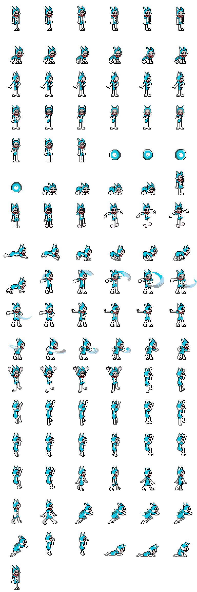
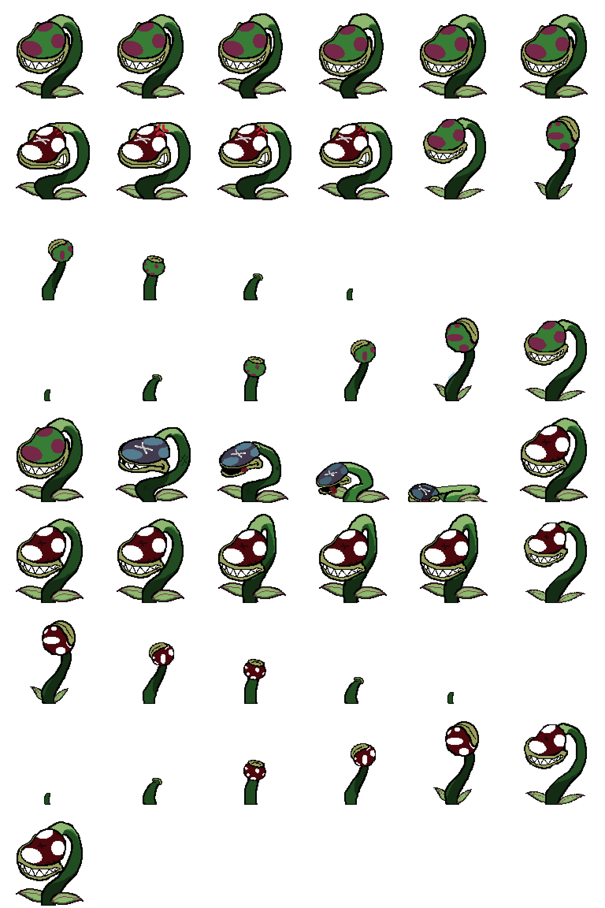

# ISHIMONDO

**Concepto:** Videojuego de plataformas en 2D con gráficos donde controlas a un gato humanoide característico.

**Trama:** Ishi estaba durmiendo placenteramente sin saber muy bien dónde estaba ni hacia dónde ir, hasta que algo perturbó su sueño. Sus orejas de gato captaron un sonido fuerte. Salió de su temporal guarida y miró al cielo en dirección del ruido. De la nada, la bestia voló a ras de los árboles, dándole una clara vista de lo que era. Era una bestia alada enorme y Ishi quedó fascinado. Trepo al árbol más grande que había para ver hacia dónde se dirigía. Su rastro llevaba más allá de las montañas, así que no perdió ni un momento más e inició su viaje para cazar a la criatura.

## Mecánicas

- **Andar:** Camina en una dirección seleccionada por el jugador. Por defecto va en dos patas.
  - **Izquierda**
  - **Derecha**

- **Agacharse:** Cambio a modo de 4 patas (Mayor velocidad y reducción de la hitbox).   

- **Salto:** Salta un total de 192 pixeles en cualquier dirección. Sirve para tambien para aplastar a los enemigos  

- **Trepar:** Permite escalar paredes (únicamente en las que están marcadas).
  - **Iniciar/Parar escalada**       
  - **Arriba**                 
  - **Abajo**                  

- **Arañazo:** Realiza dos cortes consecutivos (solo en modo de 2 patas) con sus garras. Si se encuentra en frente de un enemigo lo daña   
- **Dash:** Solo disponible mientras se realiza un salto. Agiliza el recorrido del nivel  

## Dinámicas

 -**Coleccionables**: A lo largo del nivel se encuentran las llamadas  Monedas Ishi . Al recogerlas y completar el nivel correspondiente se desbloquea un boceto
                      exclusivo sobre el desarrollo del juego.
                      
  

-**Orbes de vida**: Al derrotar a los enemigos, estos sueltan orbes de vitalidad, que podrán salvar al jugador de una situación crítica. 

    
  ###  Seta venenosa
  
  

  ### Cucaracha 

  

  ### Flora

  

## GÉNERO 
   Similar a Shovel Knight o Flynn: Son of Crimson

## PEGI 
  

## Rango de edad 
  Familiar

## Audiencia objetivo
  Tanto para chicos como para chicas

## Proximamente...  

